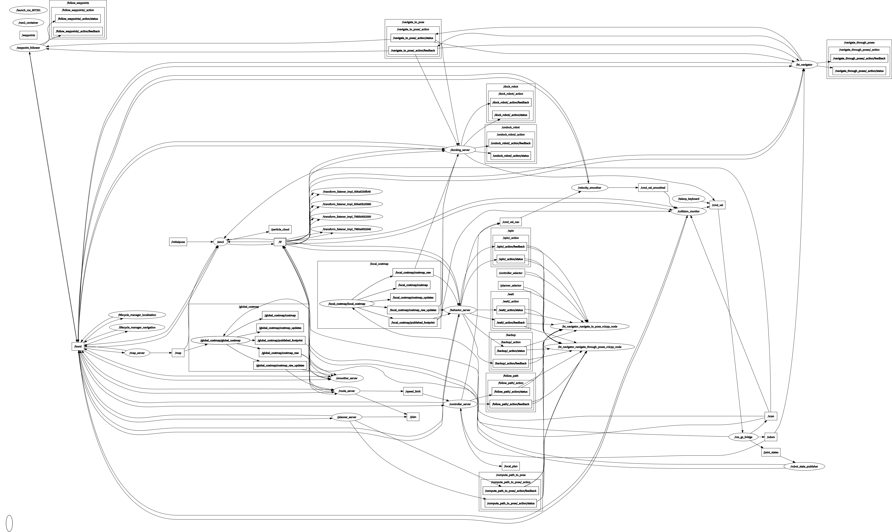

# ros2_obstacle_monitor

> 基于 **ROS2 Jazzy** 的机器人避障与导航项目：TurtleBot3 仿真 + 自定义检测/避障节点 + Nav2 导航栈，
> 覆盖「传感器感知 → 决策控制 → 全局导航」完整链路，可作为机器人开发岗简历项目。

[](https://docs.ros.org/en/jazzy/)
[](https://releases.ubuntu.com/24.04/)
[](https://www.python.org/)
[](LICENSE)

---

## 1. 项目背景

本仓库是「杰哥机器人转型 7 天计划」第一个简历主推项目，配套教程：

- 🥇 黑马 ROS2+大模型+机械臂：https://www.bilibili.com/video/BV131ZuBdEMZ
- 🥈 鱼香 ROS 动手学 ROS2：https://www.bilibili.com/video/BV764419101
- 📖 TurtleBot3 官方文档：https://emanual.robotis.com/docs/en/platform/turtlebot3/quick-start/

**简历项目描述**（知途 zeniths 同步 v1.5）：

> 基于 ROS2 Jazzy 搭建完整机器人状态监控系统，结合 TurtleBot3 仿真、自定义节点通信与 rviz2 可视化，
> 实现机器人障碍物检测、目标导航及状态监控，形成可直接展示的实操项目，适配机器人开发岗位技术需求。
> GitHub: https://github.com/JakLiao/ros2_obstacle_monitor

---

## 2. 核心功能

| 模块 | 能力 | 验证状态 |
|---|---|---|
| 🛰️ 障碍物检测 | 订阅 `/scan` 激光雷达，前向扇区 ±30° 阈值告警，发布 `/obstacle_warning` (Bool) | ✅ |
| 🛞 避障控制 | 12 扇区扫描 + 左右半边平均距离 + 0.1m 迟滞带，发布 `/cmd_vel` (TwistStamped) | ✅ |
| 🗺️ Nav2 导航 | AMCL 定位 + 全局/局部规划器 + Nav2 Action Server，rviz2 2D Pose / Nav2 Goal 可视化 | ✅ |
| 📊 节点图 | `rqt_graph` 全节点拓扑可视化 | ✅ |
| 🎥 演示视频 | 避障 + 导航 60s 录屏 | ⏳ 录屏中（见 Day 7 计划） |

---

## 3. 架构

### 3.1 节点拓扑

```
                        ┌────────────────────┐
                        │   Gazebo 仿真       │
                        │   (TurtleBot3)      │
                        └─────────┬──────────┘
                                  │ /scan (LaserScan)
                                  │ /odom
                                  │ /tf
                                  ▼
┌─────────────────────┐    ┌────────────────────┐    ┌─────────────────────┐
│ obstacle_detector   │───▶│ /obstacle_warning  │    │  Nav2 导航栈         │
│ (Python, 60°扇区)    │    │     (Bool)         │    │  ┌──────────────┐  │
└─────────────────────┘    └────────────────────┘    │  │ map_server   │  │
                                                       │  │ amcl         │  │
                                                       │  │ planner      │  │
                                                       │  │ controller   │  │
                                                       │  │ bt_navigator │  │
                                                       │  └──────┬───────┘  │
┌─────────────────────┐                                  │         │ /cmd_vel │
│ obstacle_avoider    │──────────────────────────────────┘         ▼         │
│ (Python, 12扇区)     │──▶ /cmd_vel (TwistStamped)──▶ ┌──────────────────┐ │
└─────────────────────┘                                │   ros_gz_bridge   │─┘
                                                        └──────────────────┘
```

### 3.2 数据流

```
/scan (sensor_msgs/LaserScan, 10Hz)
  │
  ├─▶ obstacle_detector ─▶ /obstacle_warning (std_msgs/Bool)
  │     └─ 前向 60° 扇区 min < 0.5m → 告警
  │
  └─▶ obstacle_avoider ─▶ /cmd_vel (geometry_msgs/TwistStamped)
        └─ 12 扇区平均 + 0.1m 迟滞带 → 前进/左转/右转
```

> ⚠️ **避障模式**下 avoider 直接发 `/cmd_vel`；**导航模式**下 avoider 关闭，`bt_navigator` 接管 `/cmd_vel`。
> 两种模式不能同时开，否则会抢话题（见踩坑 #5）。

---

## 4. 目录结构

```
ros2_obstacle_monitor/
├── README.md                                # 本文件
├── LICENSE
├── src/
│   ├── obstacle_monitor/                    # Day 3-4 核心包
│   │   ├── obstacle_monitor/
│   │   │   ├── obstacle_detector.py         # 60° 前向扇区 + 阈值告警
│   │   │   └── obstacle_avoider.py          # 12 扇区 + 左右半边平均 + 迟滞带
│   │   ├── launch/
│   │   │   └── obstacle_monitor.launch.py   # 同时启动 detector + avoider
│   │   ├── config/
│   │   │   └── nav2_burger_sim.yaml          # AMCL + Nav2 完整参数
│   │   ├── docs/
│   │   │   └── rqt_graph_nav2.png            # 节点拓扑截图
│   │   ├── package.xml
│   │   ├── setup.py
│   │   └── setup.cfg
│   ├── py_tutorial/                          # Day 1: 通信三件套基础
│   ├── py_srvcli/                            # Day 2: Service 示例
│   ├── tutorial_interfaces/                  # Day 2: 自定义 msg/srv
│   └── custom_action_interfaces/             # Day 2: 自定义 Action
```

---

## 5. 环境

### 5.1 软硬件

| 项 | 版本 |
|---|---|
| 操作系统 | Ubuntu 24.04 LTS（WSL2 / 原生双系统） |
| ROS2 | Jazzy Jalisco（apt 一键装） |
| Python | 3.12 |
| 仿真器 | Gazebo Sim（`ros-jazzy-ros-gz`）+ TurtleBot3 packages |
| 导航栈 | Nav2 Jazzy（`ros-jazzy-navigation2` + `nav2-bringup`） |
| 可视化 | rviz2 + rqt_graph + rqt_console |
| 硬件 | 无（纯仿真） |

### 5.2 apt 一键装

```bash
# ROS2 Jazzy 桌面版（参考 Day 1 启动包）
sudo apt install ros-jazzy-desktop python3-rosdep
sudo rosdep init && rosdep update

# TurtleBot3 + Gazebo + Nav2
sudo apt install ros-jazzy-turtlebot3 \
                 ros-jazzy-turtlebot3-simulations \
                 ros-jazzy-turtlebot3-gazebo \
                 ros-jazzy-navigation2 \
                 ros-jazzy-nav2-bringup \
                 ros-jazzy-ros-gz
```

---

## 6. 安装

```bash
# 1. 克隆仓库
cd ~
git clone https://github.com/JakLiao/ros2_obstacle_monitor.git
cd ros2_obstacle_monitor

# 2. 安装 ROS 依赖
sudo rosdep install -i --from-path src --rosdistro jazzy -y

# 3. colcon 编译
colcon build --merge-install

# 4. 环境加载（每次新终端都要）
source /opt/ros/jazzy/setup.bash
source ~/ros2_obstacle_monitor/install/setup.bash
```

---

## 7. 运行

### 7.1 避障模式（Day 3 demo）

```bash
# 终端 1：起 Gazebo 仿真 + TurtleBot3 空旷世界
export TURTLEBOT3_MODEL=burger
ros2 launch turtlebot3_gazebo empty_world.launch.py

# 终端 2：起避障节点（detector + avoider）
ros2 launch obstacle_monitor obstacle_monitor.launch.py

# 终端 3：手动给定速度或观察 rviz2
ros2 topic echo /obstacle_warning
ros2 topic echo /cmd_vel
```

预期：TurtleBot3 在 Gazebo 中前进，前向 0.5m 内出现障碍物时自动转向避障。

### 7.2 Nav2 导航模式（Day 4 demo）

```bash
# 终端 1：起仿真
export TURTLEBOT3_MODEL=burger
ros2 launch turtlebot3_gazebo empty_world.launch.py

# 终端 2：起 Nav2 栈（使用项目级 params_file 解决 use_sim_time 注入问题）
ros2 launch nav2_bringup bringup_launch.py \
  use_sim_time:=true \
  map:=/home/xiaoduo/ros2_ws/src/obstacle_monitor/maps/my_map.yaml \
  params_file:=/home/xiaoduo/ros2_ws/src/obstacle_monitor/config/nav2_burger_sim.yaml

# 终端 3：起 rviz2（使用项目内 .rviz 配好的视图）
rviz2 -d /home/xiaoduo/ros2_ws/src/obstacle_monitor/config/nav2_default.rviz

# 终端 4：起 obstacle_avoider（可选 — Nav2 已带局部避障）
# 注意：avoider 与 Nav2 会抢 /cmd_vel，请二选一开启
# ros2 run obstacle_monitor obstacle_avoider
```

操作：

1. rviz2 中点击 "2D Pose Estimate" 标定初始位姿
2. 点击 "Nav2 Goal" 给定目标点
3. 观察全局路径规划 + 局部避障 + 状态反馈（`ros2 action send_goal ... --feedback`）

### 7.3 节点图可视化

```bash
rqt_graph
# 或保存为 PNG
ros2 run rqt_graph rqt_graph &  # 截屏保存到 docs/rqt_graph_nav2.png
```

---

## 8. 实战踩坑（Day 4 6 条，commit 0fc0314）

### 坑 #1 `use_sim_time` launch arg 类型不匹配
**现象**：AMCL 报 `parameter 'use_sim_time' has invalid type`。
**根因**：nav2_bringup 的 launch 文件要求 `use_sim_time` 是 bool，但项目级 params_file 里同时设了同名 key 触发覆盖冲突。
**解决**：统一在 `params_file: nav2_burger_sim.yaml` 顶层写 `use_sim_time: true`，launch 端不再单独声明（项目级是唯一注入点）。

### 坑 #2 AMCL `set_initial_pose=false`（按设计）
**现象**：第一次启动时 AMCL 不动，rviz2 中粒子束分散。
**真相**：Nav2 文档明确写 `set_initial_pose: false`（避免与 rviz2 2D Pose Estimate 冲突），需要在 rviz2 中手动给初始位姿。
**操作**：见 7.2 步骤 1。

### 坑 #3 `map` 参数必传
**现象**：缺 map 参数时 `map_server` 报 `No map specified`。
**解决**：`bringup_launch.py map:=/abs/path/to/my_map.yaml`，绝对路径最稳（YOLO 之类相对路径容易翻车）。

### 坑 #4 `.rviz` 文件名 `tb3_*` 缩写
**现象**：直接用 `tb3_nav2.rviz` 时 rviz2 报 "config file not found"。
**真相**：nav2_bringup 默认找的是 `nav2_default_view.rviz` 或 `tb3_simulation_launch.rviz` 这种长名，`tb3_` 前缀不会被自动识别。
**解决**：保存 rviz 配置时用完整名 `nav2_default.rviz`，调用时 `-d /abs/path/nav2_default.rviz`。

### 坑 #5 avoider 跟 Nav2 抢 `/cmd_vel`
**现象**：avoider 和 Nav2 同时开时机器人抽风（命令叠加）。
**根因**：`/cmd_vel` 是单话题多发布者，最后订阅的 QoS 可能盖掉前面的。
**解决**：避障 demo 关 Nav2、Nav2 模式关 avoider，二选一。本项目默认走 Nav2 模式（avoider 仅作学习 demo）。

### 坑 #6 Jazzy 强制 `TwistStamped`
**现象**：用 `geometry_msgs/Twist` 发 `/cmd_vel` 时 ros_gz_bridge 静默丢包，机器人不动。
**真相**：Jazzy 的 `ros_gz_bridge` 桥接 Gazebo 时只认 `geometry_msgs/TwistStamped`（带 timestamp + frame_id），老教程的 `Twist` 写法全废。
**解决**：avoider 全用 `TwistStamped`，header 必须带 `stamp`（`get_clock().now().to_msg()`）和 `frame_id='base_footprint'`。

---

## 9. 演示

### 9.1 节点拓扑



### 9.2 避障 + 导航 60s 演示视频

> ⏳ 录屏中（Day 7 收尾时补，路径将放在 `src/obstacle_monitor/docs/demo.mp4`）

---

## 10. 关联项目 / 学习路径

| 阶段 | 仓库 / 教程 | 状态 |
|---|---|---|
| Day 1 | 本仓库 `py_tutorial` + `py_srvcli`（小乌龟 demo） | ✅ |
| Day 2 | 本仓库 `tutorial_interfaces` + `custom_action_interfaces`（通信三件套） | ✅ |
| **Day 3-4** | **本仓库 `obstacle_monitor`（TurtleBot3 + Nav2）** | **✅ 本项目** |
| Day 5-6 | 黑马 BV131ZuBdEMZ `embodied_arm_mcp`（语音大模型控制机械臂） | 🚧 启动中 |
| Day 7 | 录视频 + 简历 v1.4 | 📋 |

---

## 11. License

MIT © JakLiao
